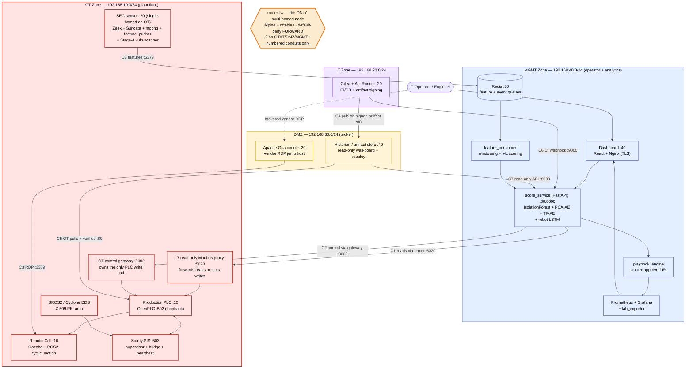
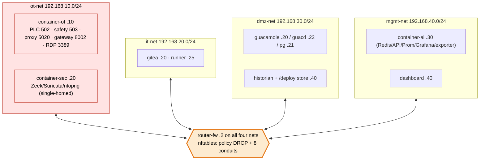
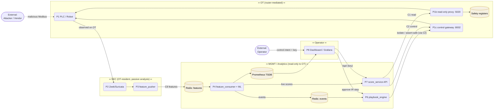
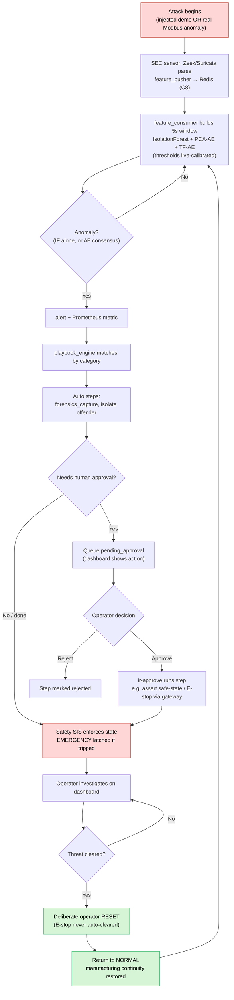
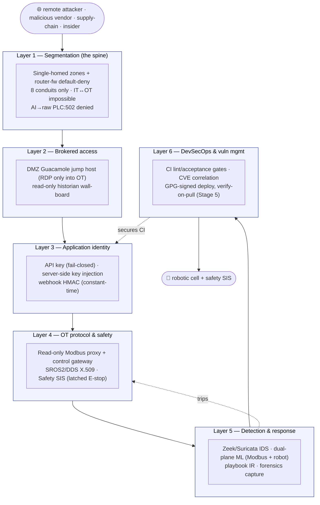
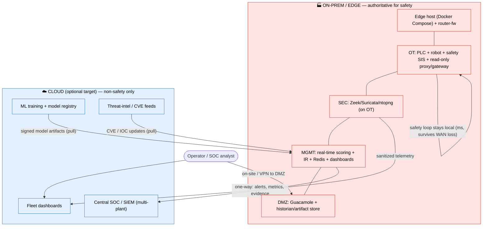

# Robotics Security Platform — Architecture Diagram Pack

This document contains six diagram families, all in **Mermaid** (renders on GitHub, VS Code with the Mermaid extension, or [mermaid.live](https://mermaid.live)). Every diagram is followed by an explanation of **component placement & justification**, **data movement**, **trust boundaries**, and **dependencies** — the four things an interviewer will probe.

> **Architecture in one line.** A true single-homed **IEC-62443 Level-3.5 IDMZ**: every service sits on exactly one zone network, and a single **router/firewall** (`router-fw`, Alpine + nftables, **default-deny**) is the only multi-homed node. Nothing crosses a zone except through an explicitly allowed **conduit**. The analytics zone is **network-enforced read-only** to OT, and new PLC code reaches the controller only as a **GPG-signed artifact the OT side pulls and verifies**.

> **How to read these diagrams**
> - **Zones** follow the Purdue / IEC-62443 model: OT (plant floor) is the most trusted-but-most-fragile and must be the most isolated; IT is general-purpose; the DMZ brokers the two; MGMT is the operator/analytics plane.
> - A **trust boundary** is any line where data crosses zones. In this build *every* crossing is a numbered firewall conduit — there are no implicit paths.
> - Subnets: **OT** `192.168.10.0/24`, **IT** `192.168.20.0/24`, **DMZ** `192.168.30.0/24`, **MGMT** `192.168.40.0/24`. The router is `.2` on all four.

---

## 1. System Architecture Diagram

High-level view of every service, the single-homed zones, and the router that mediates all cross-zone traffic.



**Component placement & justification.** The robotic cell, production PLC, and safety SIS sit in **OT** because they are real-time and safety-critical. The **SEC sensor is single-homed *inside* OT** — an OT-resident IDS — because a Docker bridge does not mirror third-party unicast to a passive port, so the monitor must be a party to the traffic (the software equivalent of a hardware SPAN tap). The **analytics + operator plane lives in MGMT**: it does the ML, response, observability, and dashboard, but holds **no write path to the PLC**. **IT** holds developer tooling and the CI signer. The **DMZ** is the only meeting point of OT and IT, and hosts the brokered Guacamole jump host and the read-only historian/artifact store. The **operator** only ever touches the MGMT dashboard or the DMZ jump host — never OT directly.

**Data movement.** (1) **Monitoring:** OT traffic → SEC sensor → features over conduit **C8** → Redis → `feature_consumer` → scoring → alerts → IR + dashboards. (2) **Control:** operator → dashboard → `score_service`, which **reads** telemetry through the OT read-only proxy (**C1**) and issues control only through the OT control gateway (**C2**) — it never speaks raw Modbus. (3) **Deploy:** CI signs in IT → publishes to the DMZ store (**C4**) → OT **pulls and verifies** (**C5**).

**Trust boundaries.** Every arrow that leaves a `subgraph` traverses `router-fw` and matches a numbered conduit (C1–C8); everything else is dropped by default. The most sensitive boundary, MGMT→OT, is split into a **read-only** conduit (C1, proxy) and an **authenticated control** conduit (C2, gateway) — there is no path from analytics to raw `PLC:502`.

**Dependencies.** `score_service`/`feature_consumer` depend on Redis + trained models; the dashboard is health-gated on `score_service`; the SEC sensor depends on OT producing traffic; the deploy agent depends on the historian serving the signed artifact.

---

## 2. Network Diagram

The four single-homed bridge networks, the central router/firewall, and the conduit allow-list.



**The conduit allow-list (everything else is dropped):**

| # | Source | → Destination | Port | Purpose |
|---|---|---|---|---|
| C1 | MGMT (AI) | OT `10.10` | 5020 | Telemetry read via **read-only** proxy |
| C2 | MGMT (AI) | OT `10.10` | 8002 | Control via OT gateway (only write path) |
| C3 | DMZ (Guacamole) | OT `10.10` | 3389 | Brokered vendor RDP |
| C4 | IT (Gitea) | DMZ `30.40` | 80 | CI publishes signed artifact up |
| C5 | OT | DMZ `30.40` | 80 | OT pulls signed artifact down |
| C6 | IT (Gitea) | MGMT `40.30` | 9000 | CI webhook → AI receiver |
| C7 | DMZ (historian) | MGMT `40.30` | 8000 | Read-only wall-board API |
| C8 | SEC `10.20` | MGMT `40.30` | 6379 | ML feature shipping (SEC-IP-scoped) |

**Component placement & justification.** Each Docker network models a VLAN, and **each container attaches to exactly one** — the segmentation guarantee is structural, not advisory. The only multi-homed node is `router-fw`, which is *supposed* to span zones (that is what a firewall is). Containers reach peers in other zones only by routing through `.2`, where nftables applies the default-deny policy.

**Data movement.** Cross-zone traffic is L3-routed through `router-fw` and filtered against the 8-conduit table; intra-zone traffic stays on its own bridge. There is no host-published OT control port — `PLC:502`/`safety:503` are reachable only inside OT.

**Trust boundaries.** The router's `FORWARD` chain *is* the trust boundary for the whole system. `IT→OT` matches no conduit → dropped on every path (the classic DMZ gap, closed). `AI→PLC:502` matches no conduit → dropped (read-only enforced at L3).

**Dependencies.** Bring-up order is handled by the router entrypoint (enables `ip_forward`, loads nftables) and per-zone return routes added by each service; the automated matrix (`infra/tests/stage1_connectivity_matrix_docker.py`) asserts all 8 conduits + key denials (16 probes, all green).

---

## 3. Data Flow Diagram (DFD)

Classic DFD — **external entities** (stadium), **processes** (rounded), **data stores** (cylinders), labelled flows, dashed **trust boundaries**.



**Component placement & justification.** Processes are grouped by the zone that runs them, so each DFD boundary equals a real firewall boundary. The decisive change from a naïve design: **the analytics process P7 has no Modbus client to the PLC** — reads go through the proxy (P1b) and any control goes through the gateway (P1c), both OT-resident. Redis decouples producers from consumers so a traffic burst can't stall scoring.

**Data movement.** Detection flows left-to-right (OT traffic → features → ML score → event → incident). Control is the return path but is **mediated**: operator → API → (read proxy | control gateway) → PLC. Observability tees into Prometheus and back to the dashboard.

**Trust boundaries.** Four crossings carry controls: (1) Attacker→PLC is the threat we detect; (2) OT→SEC analysis stays inside OT (no return path to actuate); (3) MGMT→AI API requires the key (fail-closed); (4) **AI→OT is split** into read-only (proxy) and authenticated-control (gateway) conduits — no raw write path exists.

**Dependencies.** P4/P7 depend on Redis + models; P6 on the alert store + playbooks; P7's control path depends on the OT gateway being reachable over C2.

---

## 4. Process Flow / Workflow Diagram (Incident lifecycle)

The end-to-end **attack → detect → respond → recover** workflow you demo live.



**Component placement & justification.** The flow alternates **automated** stages (detection, auto-containment) with **human-gated** stages (approval, reset) — mirroring NIST SP 800-61 (detect → contain → eradicate → recover) and the functional-safety rule that *clearing* a safety state is always a deliberate human action.

**Data movement.** Each box hands the next a small artifact: a feature window → an anomaly event → an alert → a pending-approval → an incident record. The loop back to scoring (`Q → C`) shows continuous operation.

**Trust boundaries.** The human-in-the-loop gates `H/J` (approval) and `P` (reset) are the privileged points; any physical-state change requires operator authority, and IR's control actions ride the same OT gateway conduit (C2) as operator control — never a raw write.

**Dependencies.** Approval depends on dashboard + `ir-approve`; recovery depends on the safety SIS accepting the reset; the whole loop depends on the SEC sensor + AI scoring being alive.

---

## 5. Security Architecture Diagram

Defense-in-depth: the controls layered between an attacker and the robot.



**Component placement & justification.** Controls are ordered by how early they stop an attacker: **segmentation first** (a default-deny router, not advisory rules), then brokered access, then app identity, then OT-native protocol controls + the safety SIS (the last line before the robot), with detection/response and DevSecOps wrapping the whole thing — IEC 62443 zones-and-conduits + NIST SP 800-82 in practice.

**Data movement.** An attacker must traverse every layer inward; defenders get telemetry the other way (L5 detection can trip L4 safety; L6 secures the code that becomes L4's PLC logic via the signed pull-deploy).

**Trust boundaries.** Each layer boundary is a control point. The rearchitecture made L1 a *true* default-deny firewall, made L4 a read-only-proxy + control-gateway split (no analytics write path), and made L6 a real signed-artifact supply chain (tamper-rejected on pull).

**Dependencies.** Layers are complementary: if L1 is bypassed (insider on a zone), L3/L4 still require credentials and the safety SIS still latches; if L3 is bypassed, L5 still detects anomalous behavior.

---

## 6. Cloud / Hybrid / On-Prem Architecture

**Current** deployment is fully **on-prem / edge** (one Docker host = one plant). The diagram also shows the **target hybrid** extension and *why* each piece stays where it is.



**Component placement & justification.** Anything **safety- or latency-critical stays on-prem**: PLC, robot, safety SIS, real-time scoring, and IR must keep working even if the WAN is down. The **cloud only ever receives non-safety derived data** (alerts, metrics, evidence) and only **sends back pull-based, signed artifacts** (models, CVE feeds) — the exact same signed-pull pattern the on-prem Stage-5 deploy already uses.

**Data movement.** Edge→cloud is **one-way and sanitized**; cloud→edge is **pull-only and signed**. No cloud service can command the plant.

**Trust boundaries.** Only the AI/DMZ egress may talk to the cloud, outbound only. Operators reach cloud dashboards directly but reach OT only via the on-site DMZ jump host or VPN.

**Dependencies.** The edge is self-sufficient; the cloud tier augments fleet-scale SOC/training/dashboards and its loss never stops production or safety.

---

### Diagram-to-requirement traceability

| requirements.md objective | Diagram(s) that evidence it |
|---|---|
| OT/IT convergence, DMZ, microsegmentation | 1, 2, 6 |
| Secure remote / vendor access | 1, 2, 5 |
| Network traffic & protocol monitoring | 1, 3 |
| ML anomaly detection + predictive analytics | 3, 4 |
| Automated response + safety integration | 4, 5 |
| Safety-critical protection (E-stop, SIS, interlocks) | 1, 4, 5 |
| IEC 62443 / NIST 800-82 alignment | 1, 5, 6 |
| Vulnerability management | 5, 6 |
| DevSecOps for ICS (signed deploy) | 4, 5, 6 |
| Incident response & recovery | 3, 4 |
```
