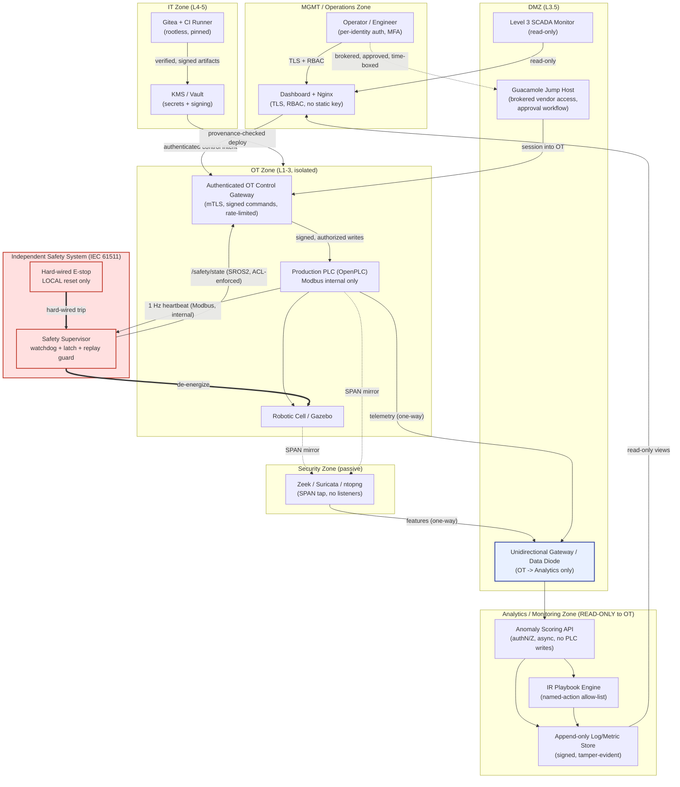

# Architectural, Security & Operational Audit
## Robotics Security Platform (OT / ICS Anomaly-Detection & Incident-Response Lab)

> **STATUS — superseded in part (2026-06-20).** This is the original production-hardening audit of the **pre-IDMZ** build. The subsequent rearchitecture **resolved the critical findings**: F-02 (monitoring-zone PLC writes) → analytics is now network-enforced read-only via a proxy/gateway; F-06 (multi-homed segmentation bypass) → single-homed zones + a default-deny router; F-10 (no deploy provenance) → GPG-signed pull-deploy. For current status see **`REQUIREMENTS-COMPLIANCE-AUDIT.md`** (requirements coverage + live verification) and **`future-plans.pdf`** (the remaining lab→production roadmap, which captures the carry-forward items below — secrets, per-identity auth, container hardening). The findings here remain accurate **as a record of the original build** and as the rationale for the rearchitecture.

**Audit date:** 2026-06-06
**Auditor role:** Principal Software Architect · Senior DevSecOps Engineer · Lead OT/ICS Security Auditor
**Codebase scope:** full repository (~13k LOC) — `vm-ot`, `vm-sec`, `vm-ai`, `dashboard`, `infra`, `hmi`, `tools`
**Method:** static read-through of all source, configuration, container, orchestration, firewall, PLC (IEC 61131-3 ST), ROS2/SROS2, and CI/CD pipeline artifacts. No code was executed or modified (audit-only engagement).

**Primary stack:** Python 3 (FastAPI, pymodbus, scikit-learn, TensorFlow-CPU), ROS 2 Humble + SROS2/Cyclone DDS, OpenPLC (Structured Text), React/TypeScript + Vite + Nginx, Redis, Prometheus/Grafana, Zeek/Suricata/ntopng, Apache Guacamole, Gitea, Docker Compose.
**Stated purpose:** centralized security monitoring, ML anomaly detection, and automated incident response for an industrial robotic cell driven over Modbus/TCP and ROS2, modelled on the Purdue/IEC-62443 zone architecture.
**Deployment model (as built):** single-host Docker Compose with four bridge networks emulating OT/IT/DMZ/MGMT zones. (A prior Vagrant/multi-VM model is still partially present in-tree — see F-06.)

---

## 1. Executive Summary & Production-Readiness Rating

This is an **ambitious, well-organized, and genuinely educational prototype** that demonstrates a credible end-to-end OT security story: Purdue-style zoning, a DMZ jump host, passive network IDS, a multi-model ML anomaly detector, an SROS2 authentication boundary, a playbook-driven incident-response engine, and a CI/CD security-gate pipeline. The author clearly understands the *concepts* of defense-in-depth, and several modules (the `safety_supervisor.py` state machine, the `playbook_engine.py` injection-aware command expansion, the constant-time webhook HMAC) are written with real care.

However, measured against **production OT/ICS deployment standards**, the system has **categorical stop-ship defects** — most seriously in the cyber-physical safety path. The platform that is supposed to *protect* the robotic cell currently provides a **network-reachable, unauthenticated path to clear an emergency-stop latch** and a **monitoring zone with Modbus write authority over the production PLC**. These are not hardening nice-to-haves; they invert the core safety and zoning guarantees the project claims to provide. Compounding this, the security telemetry the platform produces is partly **synthetic and self-resetting**, the audit/incident trail is **erased on every reboot**, the most important CI gate is **disabled in the shipped configuration**, and the sophisticated safety logic that the documentation describes **is not the code that actually runs**.

> ### Production Readiness Grade: **PROTOTYPE (Proof-of-Concept)** — *not* Staging-Ready.
>
> **Justification:** The codebase self-identifies as a lab (Vagrant heritage, `LAB_SKIP_ACCEPTANCE=1`, synthetic datasets, built-in attack-injection endpoints, a "Topic 114 curriculum" note). That is entirely appropriate for its purpose. It cannot be graded Staging-Ready because (a) a remote actor can silence/clear a safety E-stop over unauthenticated Modbus; (b) the analytics zone can issue physical control writes to the PLC; (c) authentication on the exposed API is fail-open and absent on several state-changing endpoints, including OT remote-access provisioning; and (d) the live safety controller lacks the watchdog/latch/replay protections that the design documents promise. Any one of (a)–(d) is disqualifying for an OT system; together they place the system firmly at the prototype tier.

### Severity scorecard

| Dimension | Grade | One-line verdict |
|---|---|---|
| 1. Architectural Integrity & Design Patterns | **C–** | Clean zone *intent*, but multi-homed containers and a god-object scoring service break the model; dead VM-era architecture coexists with the Docker one. |
| 2. Security Posture & Hardening | **F** | Fail-open/missing auth, remote E-stop clear, monitoring-zone PLC writes, at-rest secret reuse, command-exec via shared state file. |
| 3. Operational Resilience & Observability | **D** | No process supervision, health-check blind spots, audit trail wiped on boot, fabricated/self-resetting telemetry. |
| 4. Performance & Resource Optimization | **C** | Blocking Modbus I/O on the API threadpool, unbounded in-memory rate-limit map, train-on-boot cold starts. |
| 5. Production-Grade Gap Analysis | **D–** | Strong lab; large, well-defined distance from a hardened deployment. |

### Stop-ship issues at a glance

| ID | Severity | Finding | Primary location |
|---|---|---|---|
| **F-01** | 🔴 Critical | Emergency-stop latch can be **cleared remotely over unauthenticated Modbus** (`reg2 == 9`) | `vm-ot/sros2/sim_safety_plc.py:44-49`; `vm-ot/sros2/safety_supervisor.py:193-200`; `vm-ai/score_service.py:639-673` |
| **F-02** | 🔴 Critical | **Monitoring/analytics zone has Modbus write control** of the production & safety PLCs | `vm-ai/score_service.py:483-695` |
| **F-03** | 🔴 Critical | **Broken/fail-open authentication**; unauthenticated state-changing endpoints incl. OT vendor-access provisioning | `vm-ai/score_service.py:50-53`; `vm-ai/vendor_access.py` (all routes); `vm-ai/devsecops/webhook_receiver.py:56` |
| **F-04** | 🔴 Critical | **At-rest real secrets, secret reuse, weak defaults**, repo (incl. `.env`) bind-mounted into every container | `.env`; `docker-compose.yml`; `vm-ot/Dockerfile.ot:42-44` |
| **F-05** | 🔴 Critical | **Arbitrary command execution** from a shared-volume state file (`bash -c $cmd`) | `vm-ai/ir/bin/ir-approve:60`; shared `lab-state` volume |
| **F-06** | 🟠 High | **Zone segmentation defeated** by multi-homed containers; enforcing firewall is dead VM-era code | `docker-compose.yml` (networks); `infra/docker-fw.sh` vs `infra/iptables/host-fw.sh` |
| **F-07** | 🟠 High | **No process supervision; audit/incident state erased on every boot** | `vm-ai/entrypoint_ai.sh:13-31,164-199` |
| **F-08** | 🟠 High | **Telemetry integrity** — synthetic alerts/scores and self-reset to "nominal" | `vm-ai/score_service.py:469-473,668-671,937-992` |
| **F-09** | 🟠 High | **Claimed-vs-actual safety gap** — SROS2 topic ACLs disabled; documented supervisor not the one running | `vm-ot/sros2/bootstrap_keystore.sh` (design note); `vm-ot/entrypoint_ot.sh:126-162` |
| **F-10** | 🟠 High | **CI/CD integrity** — safety acceptance gate skipped in shipped config; ephemeral unprotected signing key | `docker-compose.yml` (`LAB_SKIP_ACCEPTANCE=1`); `vm-ai/entrypoint_ai.sh:124-138` |
| **F-11** | 🟡 Medium | **Blocking I/O on request path** + unbounded rate-limit map + dependency drift | `vm-ai/score_service.py:499-562,844-858` |
| **F-12** | 🟡 Medium | **Edge hardening gaps** — no HTTP→HTTPS redirect/headers on `:80`, unauthenticated `/prometheus/` proxy, broad CORS | `dashboard/nginx.conf` |
| **F-13** | 🟡 Low | **Container hygiene** — root user, fat images, creds on cmdline, committed cruft | all `Dockerfile.*`; `docker-compose.yml` healthcheck |

---

## 2. Deep-Dive Dimension Analysis

### Dimension 1 — Architectural Integrity & Design Patterns  (Grade: C–)

**What is good.** The conceptual architecture is sound and clearly the product of deliberate design: four named zones (OT `192.168.10.0/24`, IT `.20`, DMZ `.30`, MGMT `.40`), an `internal: true` OT network, a Guacamole DMZ jump host for vendor access, a passive SPAN-fed IDS tier, and an analytics tier kept (nominally) off the OT data path. Module boundaries map cleanly onto directories (`vm-ot` / `vm-sec` / `vm-ai`). The data plane uses a sensible Redis list pipeline (`feature_pusher → lab.modbus.features.raw → feature_consumer → lab.anomaly.events → alert_bridge`) with windowed scoring.

**F-06 — Segmentation defeated by multi-homed containers (High).**
- *Context:* `docker-compose.yml` attaches single containers to **multiple zone networks simultaneously**: `container-ot` → `ot-net` + `dmz-net` + `mgmt-net`; `container-sec` → `ot-net` + `dmz-net` + `mgmt-net`; `container-ai` → `mgmt-net` + `dmz-net` + `it-net`.
- *The risk:* A multi-homed host is an L2 bridge between "isolated" zones. Compromise of `container-ai` yields direct access to IT *and* DMZ; compromise of `container-ot` yields OT *and* DMZ *and* MGMT. The Purdue model exists precisely to prevent a single foothold from spanning zones; this topology re-introduces exactly that.
- *Architectural impact:* The only real isolation control is `internal: true` on `ot-net`, and it is undercut because the OT container itself also lives on DMZ and MGMT. Intra-bridge traffic between co-attached containers never traverses the host `FORWARD`/`DOCKER-USER` chain, so the host firewall cannot mediate it.

**F-06b — Two firewall implementations; the strong one is dead code (High).**
- `infra/iptables/host-fw.sh` is a thorough, per-role, default-deny ruleset with granular Modbus 502/503 source allow-lists and explicit safety-port isolation — but it targets the **retired Vagrant/VirtualBox VM model** (`/etc/lab/env`, `vboxnet`, `netfilter-persistent`, `systemctl`, `LAB_ROLE`) and is never invoked by the Docker deployment. `SETUP.md` instead points operators to `infra/docker-fw.sh`, which only blocks IT↔OT and `RETURN`s *all* MGMT-sourced traffic. Comments such as `# FIXED: Removed 192.168.40.1 (MGMT) block for lab-friendly dashboard access` show controls being relaxed for convenience.
- *Impact:* The repository's most credible network control is documentation, not enforcement. Dangling references to a non-existent `ARCHITECTURE.md`, `Vagrantfile`, and `infra/provision/*` confirm an incomplete migration that leaves operators unsure which model is authoritative.

**F-14 — "God object" scoring service (Medium).** `vm-ai/score_service.py` is ~1,160 lines spanning at least eight unrelated responsibilities: ML scoring, trend analytics, IR approval orchestration (shells out), SCADA/HMI Modbus control, physical-button simulation, log tailing, security-report aggregation, and an attack-injection generator. This violates separation of concerns, concentrates the blast radius of any bug or RCE, and makes least-privilege impossible (one process needs model files, Redis, the PLC, the filesystem state tree, and subprocess exec). The data plane (`feature_consumer.py`) and API (`score_service.py`) also **independently re-implement** threshold resolution and scoring, inviting drift.

**F-15 — Documentation/implementation divergence (Medium).** Module docstrings describe a system that differs from the running one: `score_service.py:9-10` claims iptables restricts `:8000` to MGMT (the cited firewall is dead code, and `:8000` is published to the host); `safety_supervisor.py` describes a watchdog/latch controller that `entrypoint_ot.sh` does not start (see F-09). Auditing by docstring would produce a materially false picture of the deployed system.

---

### Dimension 2 — Security Posture & Hardening (DevSecOps)  (Grade: F)

**F-01 — Remote, unauthenticated clearing of the safety E-stop latch (Critical, CWE-306 / IEC 61511 violation).**
- *Context:* The **live** safety controller is `vm-ot/sros2/sim_safety_plc.py`, started by `entrypoint_ot.sh:126-128`, bound to `0.0.0.0:503` and **published to the host** (`docker-compose.yml` → `"503:503"`). Its scan loop (`sim_safety_plc.py:44-49`) treats Modbus holding-register 2 == `9` as a "System Safety Reset," transitioning `safety_state` back to `0` (NORMAL) and clearing the fault — **with no authentication of any kind.** The same back-door exists in the (aspirational) `safety_supervisor.py:193-200`.
- *Reachable from the IT side too:* `score_service.py` `hmi_control` `reset`/`reset_estop` (lines 639-673) connects to `:503` and writes `register 2 = 9`, then clears the `e_stop_active`/`request_safe_state` coils on `:502`.
- *The risk:* Modbus/TCP has no authentication, authorization, or integrity. Any peer that can reach `:503` (host-exposed, plus every container co-homed on the relevant bridges) can **silence an active emergency stop** and resume motion on a physical robotic arm. This directly contradicts the system's own stated guarantee ("EMERGENCY is LATCHED … cannot un-latch except by restart," `safety_supervisor.py:18,110`).
- *Architectural impact:* The safety function is neither independent nor tamper-resistant. In a real cell this is a personnel-safety hazard, not merely a security bug.

**F-02 — Analytics/monitoring zone holds Modbus write authority over OT (Critical, IEC 62443 zone/conduit violation).**
- *Context:* `score_service.py` (running in `container-ai`, the analytics tier) defines `PRODUCTION_PLC_IP = "192.168.40.10"` and issues `write_coil`/`write_register` for `start`, `stop`, `estop`, `reset`, `enable_slow_mode`, plus direct safety-PLC writes on `:503` (lines 588-726). `simulate-button` (697-726) and `trigger-sros2-estop` (1143-1157) add more control surface.
- *The risk:* The zone explicitly described as "Deep Learning & Analytics **Monitor**" is in fact an active control client of the PLC. A monitoring plane must be read-only; granting it write control means a compromise of the *least* safety-rated, most internet-adjacent service (it also sits on `it-net`) yields physical actuation.
- *Architectural impact:* Conflates monitoring with control, collapsing the conduit model. HMI/SCADA control belongs in the OT zone behind the safety system, not in the AI container.

**F-03 — Broken, fail-open, and missing authentication (Critical, CWE-287/CWE-306).**
- *Fail-open API key:* `score_service.py:50-53` — `_require_api_key` only rejects `if _API_KEY and key != _API_KEY`. If `LAB_API_KEY` is unset/empty, **every "protected" endpoint becomes public.**
- *Fail-open webhook:* `webhook_receiver.py:56` verifies HMAC only `if WEBHOOK_SECRET:`. Empty secret ⇒ anyone can `POST /webhook` and trigger the CI/CD pipeline.
- *Endpoints with no auth at all:* the **entire vendor-access router** (`vendor_access.py`) — `POST /api/vendor/sessions` lets an unauthenticated caller **provision a Guacamole remote-access session into OT** (read-only or maintenance) with only a free-text "justification" and no approver; `GET /api/vendor/audit` leaks the access log. Also unauthenticated: `/api/hmi/state` (live PLC telemetry), `/api/ir/incidents`, `/api/ir/pending`, and `/api/stages/reports` — the last returns the full `vulnerabilities.json`, `integrity_baseline.json`, `inventory.json`, and pipeline verdicts, i.e. a turnkey reconnaissance feed of the OT environment.
- *Authentication theater via the proxy:* `dashboard/nginx.conf` injects a static `X-API-Key` header for **all** `/api/` traffic, so every user who can reach the dashboard inherits full API authority (PLC control, attack injection, vendor provisioning). The key gates only direct hits to `:8000` (which is itself host-published).

**F-04 — Secrets management (Critical, CWE-798/CWE-200).**
- A real `.env` exists on disk with live-looking values; **`LAB_API_KEY` and `GITEA_WEBHOOK_SECRET` are byte-for-byte identical** (`28fb4b8f…a941f`), so one leak compromises two controls. `GRAFANA_PASSWORD=admin`, and `docker-compose.yml` defaults Grafana to `admin` (`${GRAFANA_PASSWORD:-admin}`) and is undocumented in `.env.example`.
- The whole repository — including `.env` — is bind-mounted **read-only into every container** via `./:/vagrant:ro`, so all secrets are present in the OT, SEC, and AI containers regardless of need.
- `vm-ot/Dockerfile.ot:42-44` bakes a static OS account `lab:lab2026` into the image and adds it to the `sudo` group.
- *Mitigating:* `.gitignore` does exclude `.env` (confirmed: not tracked by git), and `.env.example` documents `openssl`-based generation. The exposure is at-rest/at-runtime, not (currently) in git history.

**F-05 — Command execution from a shared, world-writable state file (Critical, CWE-78/CWE-732).**
- `vm-ai/ir/bin/ir-approve:57-60` reads `cmd` from `/var/lab/state/ir/pending_approvals.json` and runs it via `subprocess.run(['/bin/bash','-c', cmd])`. That file lives on the `lab-state` Docker volume **mounted into OT, SEC, and AI containers**, and the platform routinely creates control files there with `os.chmod(..., 0o777)` (`score_service.py:1011,1151`).
- *The risk:* Any process able to write the shared volume can inject an arbitrary `cmd`; the next operator approval (or an `/api/ir/approve` call with the shared key) executes it as **root** inside `container-ai`. The auto-run playbook steps (`requires_human_approval: false`, e.g. `iptables -A INPUT -s ${SRC_IP} -j DROP`) execute automatically on any alert written to the equally-shared `ai-alerts.json`, enabling an attacker who can forge an alert to weaponize the IR engine for self-DoS (e.g. by naming a critical host as `SRC_IP`). *Mitigating:* `playbook_engine.py` does apply `shlex.quote` on substitutions and a `^[\d\.]+$` filter on `SRC_IP`, which blocks classic shell injection — but storing executable strings on a cross-zone writable volume remains the core defect.

**Other security observations.**
- `gitea` sets `GITEA__webhook__ALLOWED_HOST_LIST=*` (`docker-compose.yml`) — SSRF surface for webhook delivery.
- OpenPLC is `git clone`d unpinned at image build (`Dockerfile.ot`) — no commit/tag pin, no checksum: a supply-chain exposure.
- Healthcheck `redis-cli -a "${REDIS_PASSWORD}"` (`docker-compose.yml`) exposes the password on the container process list.

---

### Dimension 3 — Operational Resilience, Fail-Safes & Observability  (Grade: D)

**F-07 — No process supervision; silent partial failure; audit trail destroyed on boot (High).**
- *No supervisor:* `entrypoint_ai.sh:164-199` launches **nine** services (Redis, Prometheus, Grafana, uvicorn/FastAPI, feature_consumer, alert_bridge, webhook_receiver, lab_exporter, playbook_engine) with `&`, then PID 1 blocks on `tail -f`. If any service crashes, nothing restarts it and the container never exits — so Docker's `restart: unless-stopped` cannot help. A cascading failure in the IR engine or feature consumer is invisible at the orchestration layer.
- *Health-check blind spot:* the only healthcheck pings Redis. FastAPI, the IR engine, or the alert bridge can be dead while the container reports healthy and `container-sec` (which `depends_on: container-ai: service_healthy`) proceeds against a broken AI tier.
- *Self-erasing security state:* `entrypoint_ai.sh:13-31` truncates `ai-alerts.json` and deletes `incidents.jsonl`, `pending_approvals.json`, and offset files on **every boot** "so the dashboard starts blank." For a security/IR platform this destroys the audit and forensic record; an attacker who can bounce the container erases the incident history.
- *Corrupted entrypoint:* lines 200-252 are an orphaned duplicate of 140-199 (unreachable after the blocking `tail -f`) and include a stray `090 > … &` fragment — evidence of a botched edit and a maintainability hazard.

**F-08 — Telemetry integrity / observability theater (High).**
- `score_service.py` fabricates security signal: `_write_synthetic_alert_direct` (937-992) writes alerts tagged `lab-ai-score-direct`, and `_push_synthetic_score` (873-899) injects anomalous points into the trend history. More seriously, closing an incident (`post_ir_approve`, 469-473) or issuing a `reset` (668-671) **clears `_score_history` and appends a hard-coded "nominal" sample** `(time, 0.01, 0.1, False)`.
- *The risk:* The dashboard's threat gauge and sparkline therefore do not reflect ground truth and can be reset to "all clear" by an API action. A monitoring system that can be made to *look* healthy on command cannot be trusted for incident detection or response metrics.

**Safety fail-behavior (mixed).** The intended watchdog design (`safety_supervisor.py`) is genuinely fail-safe: loss of heartbeat latches EMERGENCY, and a dead Modbus thread starves the heartbeat into the same latch. But the **running** controller (`sim_safety_plc.py`) has *no* watchdog, *no* replay guard, and *no* latch — it merely mirrors registers — so heartbeat loss does **not** trip a safe state, and `reg2→0` silently returns to NORMAL (see F-01/F-09). Net resilience of the safety path is therefore weaker than documented.

**Logging.** Logs are append-only JSON-lines on shared volumes with `json-file` rotation (`max-size: 10m`, `max-file: 3`) — reasonable for a lab, but there is no central, tamper-evident, or access-controlled log store, and the IDS→syslog→Zeek correlation referenced in comments is aspirational. Pervasive `except Exception: pass` (e.g. `score_service.py:246-247,261-262`) silently swallows errors that an operator would need to see.

---

### Dimension 4 — Performance & Resource Optimization  (Grade: C)

**F-11 — Blocking I/O on the request path & unbounded limiter (Medium).**
- `hmi_state` (499-562) and `hmi_control` (588-695) perform **synchronous** `ModbusTcpClient` connect/read/write inside `def` endpoints. FastAPI runs sync handlers in a bounded threadpool; `hmi_state` issues three reads per call and is polled by the dashboard, so an unreachable or slow PLC (each op carries a 1 s timeout) ties up workers and can stall the whole API. These should be async or delegated to a single OT-side broker with a cache.
- The in-memory rate limiter (`_rate_limit_store`, 844-858) is keyed by `ip:action` and **never evicts stale keys** → unbounded memory growth under many source IPs, and it is per-process, so it is ineffective across uvicorn workers/replicas.

**Other performance notes.**
- *Train-on-boot:* `entrypoint_ai.sh:89-122` trains three models at container start when artifacts are missing (TensorFlow + scikit-learn), producing slow, non-deterministic cold starts (`start_period: 120s`) and coupling availability to training success. Models should be versioned pipeline artifacts.
- *Dependency drift:* `pymodbus` is pinned to **3.6.8** (`vm-ai/requirements.txt`), **3.7.2** (`vm-sec`), and **3.7.4** (`vm-ot`) across components — behavioral skew risk and a larger patch surface.
- `_trend_summary` recomputes `numpy.polyfit` on every `/api/trend` poll; negligible at 60 samples but indicative of per-request compute that should be cached.

---

### Dimension 5 — Production-Grade Gap Analysis  (Grade: D–)

| Capability | Lab / Prototype (current) | Hardened Production (target) |
|---|---|---|
| Safety controller | Python/`sim_safety_plc.py` co-located in the OT container; no watchdog/latch live; remote `reg=9` reset | Physically/logically **independent** Safety Instrumented System (IEC 61511), hard-wired E-stop, no network un-latch path |
| Zoning | Multi-homed containers on one host; OT control ports published to host | Per-zone hosts/VLANs, unidirectional gateway/data-diode to the analytics zone, no host publication of OT ports |
| AuthN/AuthZ | Single shared API key, fail-open, missing on many routes | Per-identity authN, RBAC, mTLS between services, signed approvals; no fail-open paths |
| Monitoring plane | Holds PLC **write** authority; emits synthetic/self-reset telemetry | Strictly **read-only**; immutable, signed, externally shipped telemetry |
| Secrets | At-rest `.env`, reused values, mounted everywhere | Vault/SOPS or orchestrator secrets, per-service scoping, rotation |
| CI/CD | Safety gate skipped in shipped config; ephemeral unprotected GPG key | All gates enforced; HSM/KMS-backed signing; verified provenance (SLSA) |
| Resilience | `&` + `tail -f`, no restart, state wiped on boot | Supervised processes (systemd/s6/k8s), liveness/readiness probes, durable audited state |
| Containers | Root, fat single-stage images, build tools shipped | Non-root, minimal/distroless multi-stage, read-only rootfs, dropped caps |

**F-09 — Claimed-vs-actual safety & authorization (High).**
- *SROS2 ACLs are off:* `bootstrap_keystore.sh`'s design note states the per-topic permissions were reverted to "default (wide-open within the keystore)" because Cyclone DDS hung, so the `permissions/*.xml` files (e.g. "`ai_subscriber` MUST NOT publish `rt/safety/request`") are "documentation … not installed into the live keystore." DDS still enforces *authentication* (a valid enclave cert), but **not authorization** — any cert-holding node can publish to the safety topics.
- *Wrong supervisor runs:* `entrypoint_ot.sh` starts `sim_safety_plc.py` (the dumb register store) and `safety_bridge.py`/`safety_heartbeat.py`; it never starts `safety_supervisor.py`, whose watchdog/latch/replay logic the docs present as the safety core. The IEC-61131 `safety_supervisor.st` is labelled the "normative spec" yet **diverges from both** running code (it has no `reg=9` reset rung) and carries a cosmetic `(* SIGNED_BY: lab-release@lab.local *)` comment that is not a real signature.

**F-10 — CI/CD & supply-chain integrity (High).** `docker-compose.yml` sets `LAB_SKIP_ACCEPTANCE=1` for `container-ai`, so `run_pipeline.sh` Gate 6 (the Stage-2 replay + Stage-3 safety loop) is **always skipped** in the deployed environment while the pipeline still records `verdict: PASS` — a green build that never tested safety, contradicting the script's own "production deploys must run it" comment. Artifact signing uses a 3072-bit RSA key generated at runtime with `%no-protection` (no passphrase) and no external trust anchor (`entrypoint_ai.sh:124-138`), so signatures provide no meaningful provenance.

**F-12 / F-13 — Edge & container hygiene (Medium/Low).** The `:80` Nginx server has no security headers and no redirect to `:443` (the headers exist only on the 443 block); `/prometheus/` and `/grafana/` are reverse-proxied with no edge auth (Prometheus is unauthenticated by default → metrics/recon); CORS uses `allow_credentials=True` with a broad localhost origin list. All application containers run as **root** (no `USER`), are single-stage fat images shipping `build-essential`/`git`/`nmap`, and the OT image additionally ships a full XFCE+xrdp desktop (large attack surface). Committed cruft includes `vm-ot/openplc/production.st.bak` and `infra/tests/all_smoke.log`.

---

## 3. Critical Vulnerabilities & Anti-Patterns (The "Stop-Ship" Issues)

Fix **all five** before this system is connected to anything that can move, or exposed beyond an isolated bench:

1. **F-01 — Network-clearable safety E-stop.** Remove the `reg == 9` reset path entirely (`sim_safety_plc.py:44-49`, `safety_supervisor.py:193-200`). An E-stop reset must require a physical, local, deliberate action and must never be reachable over Modbus or HTTP. Stop publishing `:502`/`:503` to the host.
2. **F-02 — Monitoring zone can actuate the PLC.** Strip all Modbus *write* capability from `score_service.py`. The analytics tier must be read-only; relocate any legitimate HMI control to an authenticated OT-zone service behind the safety system.
3. **F-03 — Fail-open / missing authentication.** Make auth fail-closed (reject when the key is unset), and require per-identity authentication + authorization on every state-changing route — especially the vendor-access provisioning endpoints and `inject-attack`. Remove the unauthenticated security-posture disclosure (`/api/stages/reports`, `/api/ir/*`).
4. **F-04 — Secrets.** Rotate every value in `.env` (they must be treated as compromised), eliminate the `LAB_API_KEY`/`GITEA_WEBHOOK_SECRET` reuse, remove `admin` Grafana default, stop bind-mounting the repo/`.env` into containers, and remove the baked-in `lab:lab2026` account.
5. **F-05 — Command-exec via shared state.** Stop persisting executable shell strings in `pending_approvals.json`; replace with a fixed allow-list of parameterized, named actions. Remove `0o777` on shared control files and split the `lab-state` volume so OT/SEC/AI do not share a writable IPC surface.

**Honorable-mention anti-patterns (fix-soon):** multi-homed zone-bridging containers (F-06), no process supervision + boot-time audit wipe (F-07), synthetic/self-resetting telemetry (F-08), disabled safety CI gate (F-10), and the documented-but-not-deployed safety supervisor (F-09).

---

## 4. Prioritized Remediation Roadmap

### P0 — Immediate (safety, crash, data-corruption, critical security)
1. **Sever every remote safety-reset path** (F-01): delete the `reg=9` un-latch logic; require local physical reset; reinstate hardware-style latching in the *running* controller. *(safety)*
2. **Make the analytics zone read-only to OT** (F-02): remove Modbus writes from `score_service.py`; if HMI control must exist, move it into an authenticated OT service behind the SIS. *(zoning)*
3. **Fail-closed auth everywhere** (F-03): reject on unset key; add per-route authZ; protect/lock down vendor-access, IR, and attack-injection endpoints; remove unauthenticated posture disclosure. *(authN/Z)*
4. **Rotate and externalize all secrets** (F-04): new unique values per control; orchestrator/Vault secrets; un-mount the repo/`.env`; drop the static OS account.
5. **Eliminate state-file command execution** (F-05): named-action allow-list; remove world-writable control files; stop publishing OT control ports to the host.
6. **Stop wiping the audit trail on boot** (F-07): persist `incidents.jsonl`/alerts/approvals; reset only via an explicit, audited maintenance action.

### P1 — High (resilience, segmentation, integrity)
7. **De-multi-home the containers** (F-06): one zone per network interface; introduce a unidirectional gateway (or data-diode pattern) from OT/SEC toward the analytics tier; retire `host-fw.sh` or port its rules into the Docker `DOCKER-USER` chain as the single source of truth.
8. **Supervise processes** (F-07): adopt systemd/s6/supervisord (or split into one-service-per-container / Kubernetes) with liveness + readiness probes that actually exercise FastAPI, the IR engine, and the feature consumer — not just Redis.
9. **Trustworthy telemetry** (F-08): remove synthetic alert/score injection and the "reset-to-nominal" behavior; ship logs/metrics to an append-only, access-controlled store.
10. **Restore the real safety supervisor & enforce SROS2 ACLs** (F-09): run `safety_supervisor.py` (or a real second OpenPLC), resolve the Cyclone DDS ACL issue so topic-level permissions are enforced, and reconcile the `.st` spec with the deployed logic; replace the cosmetic `SIGNED_BY` comment with a verified signature checked in CI.
11. **Enforce the full CI pipeline** (F-10): remove `LAB_SKIP_ACCEPTANCE=1` from any non-unit path; sign artifacts with a KMS/HSM-backed key and verify provenance before deploy; pin the OpenPLC checkout.
12. **Fix request-path blocking & limiter** (F-11): async or broker-mediated Modbus with a cached read model; a shared (Redis-backed) rate limiter with key expiry; unify `pymodbus` versions.

### P2 — Medium / Low (hardening, hygiene, observability polish)
13. **Edge hardening** (F-12): redirect `:80`→`:443`, apply security headers on both blocks, place `/prometheus/` and `/grafana/` behind authentication, tighten CORS.
14. **Container hardening** (F-13): non-root `USER`, minimal/distroless multi-stage images, read-only root filesystem, `cap_drop: [ALL]` + only required caps, remove `nmap`/desktop from runtime images, `.dockerignore` the repo cruft and `.env`.
15. **Code quality:** decompose the `score_service.py` god object along its responsibilities; replace `except Exception: pass` with logged handling; delete the duplicated/corrupted tail of `entrypoint_ai.sh`; remove committed `.bak`/`.log` artifacts; add dependency and container vulnerability scanning (e.g. `pip-audit`, Trivy) as real CI gates rather than a static `vulnerabilities.json`.

---

## 5. Architectural Diagram Suggestion (Recommended Hardened State)

The diagram below shows the target data flow after remediation: strict per-zone hosts, an **authenticated control gateway** in the OT zone, a **one-way** path from OT/SEC into the analytics tier (no return control path), an **independent SIS** with a local-only reset, and the analytics/monitoring plane reduced to **read-only**.

**Key invariants the hardened design enforces (and the current system violates):**
1. **Control is one-directional and authenticated** — operators express *intent* to an OT-zone gateway that performs signed, authorized writes; the analytics zone never writes to the PLC (fixes F-02).
2. **Safety is independent and locally resettable** — the SIS cannot be un-latched over any network protocol (fixes F-01), runs the real watchdog/latch logic (fixes F-09), and is hard-wired to de-energize the cell.
3. **OT→Analytics is one-way** — a unidirectional gateway/diode removes the return control path that multi-homing currently provides (fixes F-06).
4. **Identity, secrets, and provenance are first-class** — per-identity authN/Z, KMS-backed secrets/signing, and provenance-verified deploys replace the shared fail-open key, reused `.env` secrets, and ephemeral signing key (fixes F-03, F-04, F-10).

---

### Closing note
The engineering instincts here are good and the breadth is impressive for a single codebase — the gap to production is not one of effort or understanding but of **safety independence, trust boundaries, and honest telemetry**. Treat the five P0 items as blocking, and the system can mature from an excellent teaching prototype toward a defensible reference design. As built today, it should remain on an isolated bench with no physical actuation.

*Prepared as an audit-only engagement: findings are evidenced against the source at the cited paths/lines; no code was modified.*
