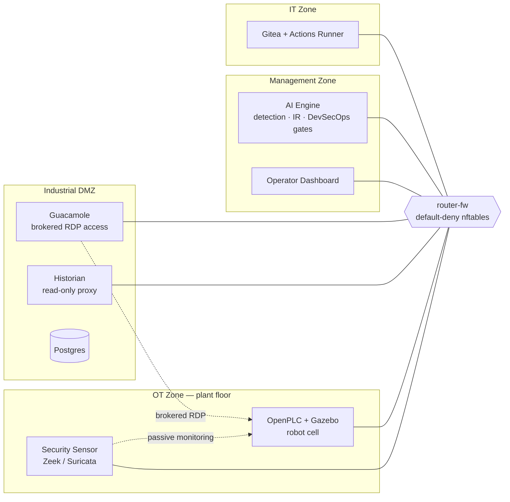

# Robotics IDMZ Security Platform

A containerized Industrial DMZ (IDMZ) reference environment built around a
robotic plant floor — combining a segmented Purdue-model network, an ML-based
anomaly detection and incident-response pipeline, and a DevSecOps gate that
blocks unsafe PLC/HMI/SROS2 code before it ever reaches the plant.

The goal is to model, end to end, how an industrial control network is
actually secured in practice: zone segmentation and brokered vendor access,
passive network monitoring feeding a detection pipeline, MITRE ATT&CK for ICS
classification and playbook-driven response, and CI/CD gates on control-system
code — rather than any single piece of that story in isolation.

## Architecture

Every service container is single-homed to exactly one network zone.
`router-fw` is the only multi-homed node in the stack and is the sole
enforcement point for cross-zone traffic, via default-deny nftables rules —
there is no direct IT-to-OT or OT-to-IT path.



| Zone | Network | Services |
|---|---|---|
| OT (plant floor) | `ot-net` | `container-ot` — OpenPLC, Gazebo simulation, SROS2 safety supervisor |
| Security | `ot-net` (monitor) | `container-sec` — Zeek, Suricata, passive traffic monitoring, attack injection harness |
| Management | `mgmt-net` | `container-ai` — detection, incident response, DevSecOps engine; `dashboard` — operator UI |
| Industrial DMZ | `dmz-net` | `guacamole`/`guacd` — brokered, session-recorded vendor access; `historian` — read-only data view; `postgres` |
| IT | `it-net` | `gitea` + `runner` — source control and CI |

## Detection & incident response

- **Two detection planes**: an IsolationForest + PCA ensemble over Modbus
  traffic features, and an LSTM autoencoder over robot joint dynamics, fused
  by a meta-scorer.
- **7-technique MITRE ATT&CK for ICS classifier** — every anomaly is
  fingerprinted from observed protocol fields (write function codes, register
  addresses) and tagged with a real technique: `T0855` Unauthorized Command
  Message, `T0831` Manipulation of Control, `T0814` Denial of Service,
  `T0846` Remote System Discovery, `T0880` Loss of Safety, `T0836` Modify
  Parameter, `T0843` Program Download.
- **Playbook-driven response** — classified incidents open a case with a
  per-technique playbook, evidence bundle, and auto-isolate/approve-to-escalate
  workflow (`vm-ai/ir/`).

## DevSecOps pipeline

`vm-ai/devsecops/run_pipeline.sh` is the single gate engine used by both CI
(`.gitea/workflows/ci.yml`) and the in-lab push webhook, so a check can never
pass in one path and fail in the other:

| Gate | Checks |
|---|---|
| 1 — PLC | Structured Text lint: unsigned programs, missing E-stop guards, hard-coded credentials, safety-output writes outside a `SAFETY_` block, unbounded loops |
| 2 — HMI | HMI/SCADA screen lint |
| 3 — SROS2 | Permission/policy lint |
| 4 — Vulnerability | Dependency + service CVE scan, CVSS ≥ 7 blocking with audited exceptions |
| 5 — Baseline | Drift check against the recorded network/behavioral baseline |
| 6 — Acceptance | Live replay + safety-loop timing gate (≤ 200 ms E-stop response) |

See [demos/cicd-gate](demos/cicd-gate) for a worked example: a vulnerable
manual-jog PLC routine that the gate rejects, and the hardened version it
accepts.

## Validation suite

`infra/tests/` is a set of confirmation gates, one per architecture stage —
cross-zone connectivity (IDMZ conduits match default-deny expectations),
detection accuracy (steady baseline stays calm, all injected attacks are
caught), SROS2 safety-loop timing and unauthenticated-peer rejection, and IR
classification/playbook correctness. `validate_ai.py` and `validate_ir.py` in
particular are run before any model or pipeline change is accepted, so
regressions are caught before they reach the demo.

## Tech stack

| Layer | Technology |
|---|---|
| Frontend | React 18, TypeScript, Vite, Tailwind CSS, Recharts |
| AI / detection | Python, scikit-learn, TensorFlow (LSTM autoencoder), FastAPI, Redis |
| OT | OpenPLC, Gazebo, ROS 2 / SROS2 (DDS-Security) |
| Security monitoring | Zeek, Suricata, ntopng |
| DMZ / access broker | Apache Guacamole, PostgreSQL |
| CI/CD | Gitea, Gitea Actions |
| Observability | Prometheus, Grafana |
| Networking | nftables, single-homed Docker zone networks |

## Repository layout

```
vm-ot/       PLC programs (Structured Text), robot control, SROS2 safety supervisor
vm-sec/      Network monitoring, attack injection, vulnerability scanning
vm-ai/       Detection models, MITRE classifier, IR playbooks, DevSecOps pipeline
infra/       Router firewall, Guacamole/DMZ provisioning, per-stage validation gates
dashboard/   Operator-facing web UI
hmi/         HMI/SCADA screen definitions
demos/       CI/CD gate demo — vulnerable vs. hardened PLC program
```

## Running the lab

Requires Docker and Docker Compose.

```bash
cp .env.example .env
# fill in every value in .env — see the comments in that file for how to
# generate each one (POSTGRES_PASSWORD, LAB_API_KEY, REDIS_PASSWORD, etc.)
docker compose up -d --build
```

| Service | URL |
|---|---|
| Operator dashboard | `http://localhost:8888` |
| AI engine API | `http://127.0.0.1:8000` |
| OpenPLC web UI | `http://localhost:8080` |
| Guacamole (vendor access broker) | `http://localhost:8081` |
| Historian (read-only) | `http://localhost:8086` |
| Grafana | `http://localhost:3003` |
| Prometheus | `http://localhost:9090` |
| Gitea | `http://localhost:3000` |

## Security notes

- `infra/dmz/initdb/03-lab-connections.sql` provisions demo-only credentials
  for the Guacamole vendor-access broker (isolated lab network, private
  addressing only) — rotate these before using this outside a throwaway lab.
- `.env` is never committed; copy `.env.example` and generate your own values
  for every secret before running the stack.
